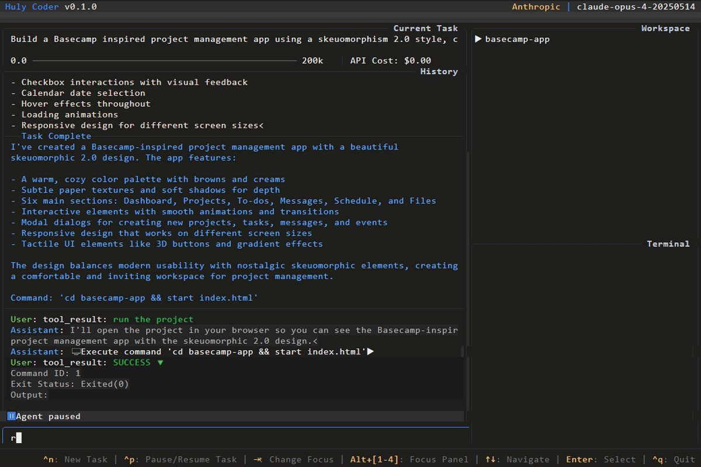

# Huly Coder

A lightweight autonomous AI coding agent with terminal-based UI, inspired by Codex and Cline.



## Features

- **Terminal User Interface (TUI)**: Clean and intuitive terminal interface with file tree, message history, and task status display
- **Smart File Operations**: Tools for reading, writing, searching, and modifying files with precision
- **Web Integration**: Built-in web search and URL fetching capabilities
- **Memory System**: Persistent knowledge graph for maintaining context across sessions
- **Multiple LLM Providers**: Support for OpenRouter, LMStudio, and OpenAI
- **MCP Servers**: Support for multiple MCP servers 
- **Docker Support**: Easy containerization for portable development environments

## Configuration

The agent's configuration is stored in `huly-coder.yaml`:

```yaml
provider: OpenRouter        # LLM provider (OpenRouter, LMStudio or OpenAI)
model: anthropic/claude-3.5-sonnet  # LLM model to use
workspace: ./target/workspace       # Working directory for the agent
user_instructions: |               # Custom personality/role instructions
    You are dedicated software engineer working alone. You're free to choose any technology, 
    approach, and solution. If in doubt please choose the best way you think. 
    Your goal is to build working software based on user request.
```

## Running
There are several ways to run Huly Coder:

### From NPM Registry

Create a `huly-coder-local.yaml` file with overrided configurations and run the following command:

```bash
npx huly-coder -d <data_dir> -s <huly-coder-local.yaml>
```

### Official Docker Image

To run Huly Coder in docker, create a `huly-coder-local.yaml` file in your `data` directory with overrided configurations and run the following command:

```bash
docker run -e DOCKER_RUN=1 \
    -v "<workspace_dir>:/target/workspace" \
    -v "<data_dir>:/data" \
    -v "<data_dir>/.fastembed_cache:/.fastembed_cache" \
    -it --rm hardcoreeng/huly-coder:latest
    --config /data/huly-coder-local.yaml
    --data /data
```

### Local Run

To run Huly Coder locally, run:

```bash
cargo run -d <data_dir> -s <huly-coder-local.yaml>
```

## Docker

### Building Huly Coder

To build the Huly Coder image, run:

```bash
cargo xtask build-docker
```

### Running Huly Coder

To run the Huly Coder image:

Create a `huly-coder-local.yaml` file in your `data` directory with overrided configurations and run the following command:

```bash
cargo xtask run-docker <data_dir> <workspace_dir>
```

## Contributing

Contributions are welcome! Please feel free to submit a Pull Request. For major changes, please open an issue first to discuss what you would like to change.

## License

This project is licensed under the MIT License - see the [LICENSE](LICENSE) file for details.
